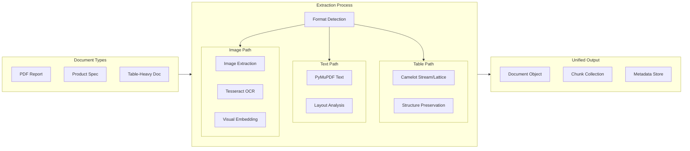
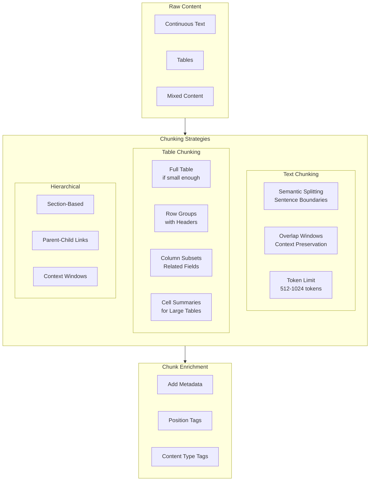
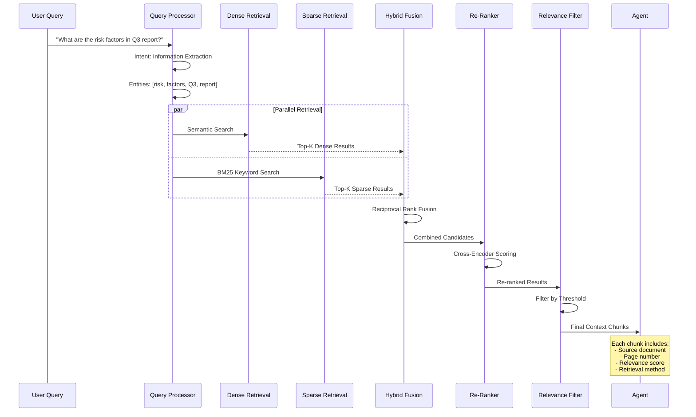
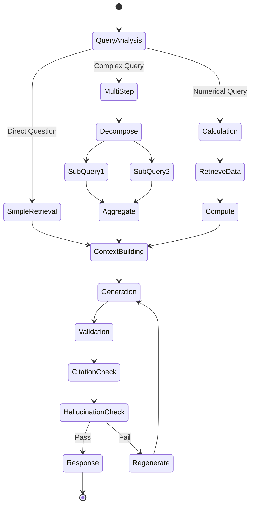
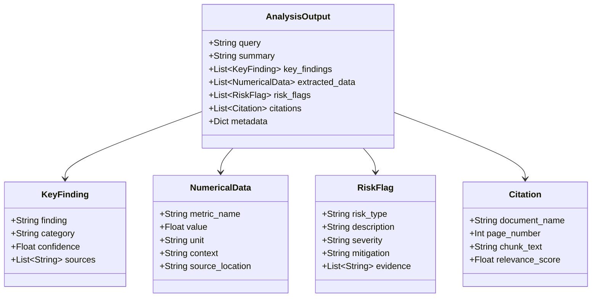
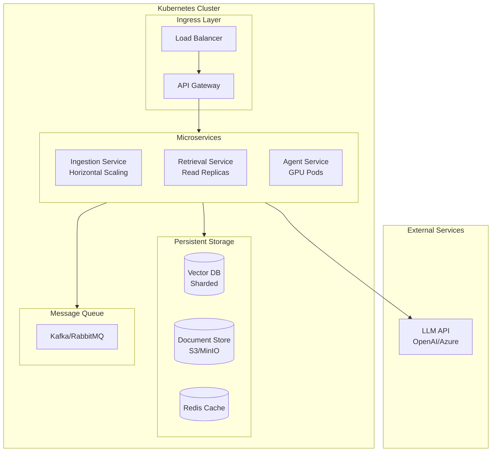
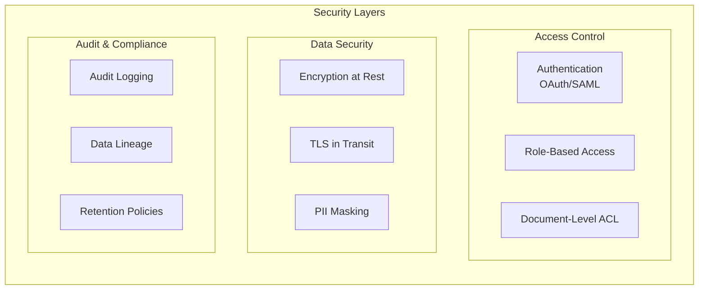

# Multimodal RAG Architecture for Enterprise Document Analysis

## System Overview

```mermaid
flowchart TB
    subgraph Input["Document Input Layer"]
        PDF[PDF Documents]
        IMG[Screenshots/Images]
        TBL[Tables/Spreadsheets]
        LOG[Logs/Emails]
    end

    subgraph Ingestion[" Ingestion Pipeline"]
        direction TB
        DOC_LOADER[Document Loader]
        
        subgraph Extractors["Multi-Modal Extractors"]
            TEXT_EXT[Text Extractor<br/>PyMuPDF/pdfplumber]
            TABLE_EXT[Table Extractor<br/>Camelot/Tabula]
            IMAGE_EXT[Image Extractor<br/>+ OCR Tesseract]
            META_EXT[Metadata Extractor]
        end
        
        DOC_LOADER --> TEXT_EXT
        DOC_LOADER --> TABLE_EXT
        DOC_LOADER --> IMAGE_EXT
        DOC_LOADER --> META_EXT
    end

    subgraph Processing[" Processing Layer"]
        direction TB
        
        subgraph Chunking["Smart Chunking Engine"]
            SEM_CHUNK[Semantic Chunker<br/>Context-Aware Splits]
            TABLE_CHUNK[Table-Aware Chunker<br/>Row/Column Preservation]
            HIER_CHUNK[Hierarchical Chunker<br/>Section Boundaries]
        end
        
        subgraph Enrichment["Chunk Enrichment"]
            META_TAG[Metadata Tagging]
            ENTITY_EXT[Entity Extraction]
            REL_MAP[Relationship Mapping]
        end
        
        Chunking --> Enrichment
    end

    subgraph IndexLayer["Hybrid Index Layer"]
        direction LR
        
        subgraph VectorDB["Vector Store (ChromaDB)"]
            DENSE_IDX[Dense Embeddings<br/>sentence-transformers]
            IMG_EMB[Image Embeddings<br/>CLIP/ViT]
        end
        
        subgraph SparseIdx["Sparse Index"]
            BM25[BM25 Index<br/>Keyword Search]
            STRUCT_IDX[Structured Index<br/>Table Metadata]
        end
        
        subgraph KG["Knowledge Graph"]
            ENT_STORE[Entity Store]
            REL_STORE[Relationship Store]
        end
    end

    subgraph Retrieval[" Intelligent Retrieval"]
        direction TB
        
        QUERY_PROC[Query Processor<br/>Intent Classification]
        
        subgraph RetrievalMethods["Retrieval Methods"]
            DENSE_RET[Dense Retrieval<br/>Semantic Search]
            SPARSE_RET[Sparse Retrieval<br/>BM25 Keywords]
            HYBRID_RET[Hybrid Fusion<br/>RRF/Linear Combo]
        end
        
        subgraph ReRanking["Re-Ranking & Filtering"]
            CROSS_ENC[Cross-Encoder<br/>Reranker]
            REL_FILTER[Relevance Filter<br/>Threshold-based]
            DEDUP[Deduplication]
        end
        
        QUERY_PROC --> RetrievalMethods
        RetrievalMethods --> ReRanking
    end

    subgraph Agent[" RAG Agent"]
        direction TB
        
        ORCHESTRATOR[Agent Orchestrator]
        
        subgraph Tools["Agent Tools"]
            SEARCH_TOOL[Search Tool]
            CALC_TOOL[Calculator Tool]
            VALIDATE_TOOL[Validation Tool]
        end
        
        subgraph Generation["Answer Generation"]
            CONTEXT_BUILD[Context Builder]
            PROMPT_ENG[Prompt Engineering]
            LLM[LLM<br/>Gemini/Claude]
        end
        
        subgraph QA["Quality Assurance"]
            CITE_GEN[Citation Generator]
            FACT_CHECK[Fact Checker]
            HALLUC_DET[Hallucination Detector]
        end
        
        ORCHESTRATOR --> Tools
        Tools --> Generation
        Generation --> QA
    end

    subgraph Output[" Output Layer"]
        SUMMARY[Natural Language Summary]
        JSON_OUT[Structured JSON Output]
        VIZ[Visualizations]
        AUDIT[Audit Trail]
    end

    Input --> Ingestion
    Ingestion --> Processing
    Processing --> IndexLayer
    IndexLayer --> Retrieval
    Retrieval --> Agent
    Agent --> Output

    style Input fill:#e1f5fe
    style Ingestion fill:#fff3e0
    style Processing fill:#f3e5f5
    style IndexLayer fill:#e8f5e9
    style Retrieval fill:#fce4ec
    style Agent fill:#fff8e1
    style Output fill:#e0f2f1
```

## Detailed Component Breakdown

### 1. Document Ingestion Pipeline

### 2. Chunking Strategy

### 3. Hybrid Retrieval Flow

### 4. Agent Decision Flow

### 5. Output Schema

## Scaling Architecture (Production)

## Security Considerations (Enterprise)

